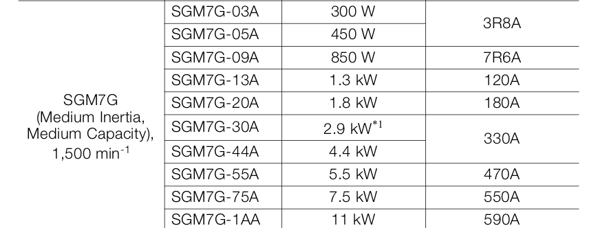
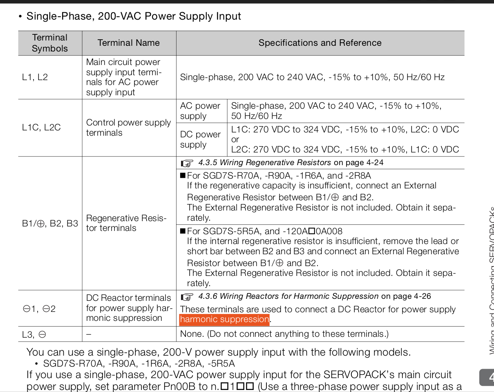
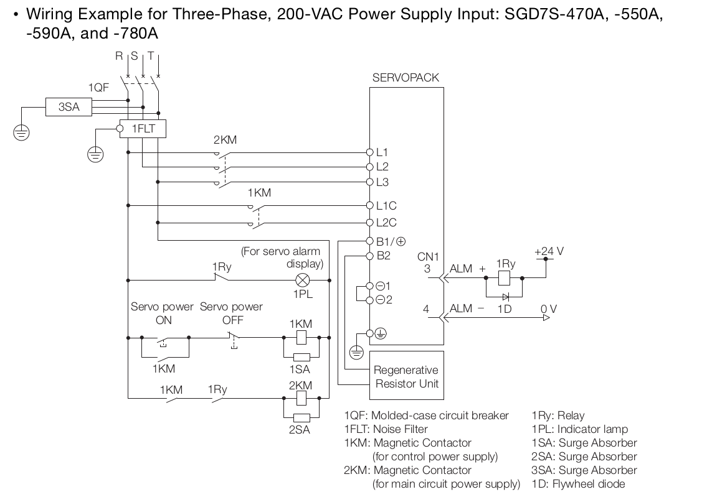
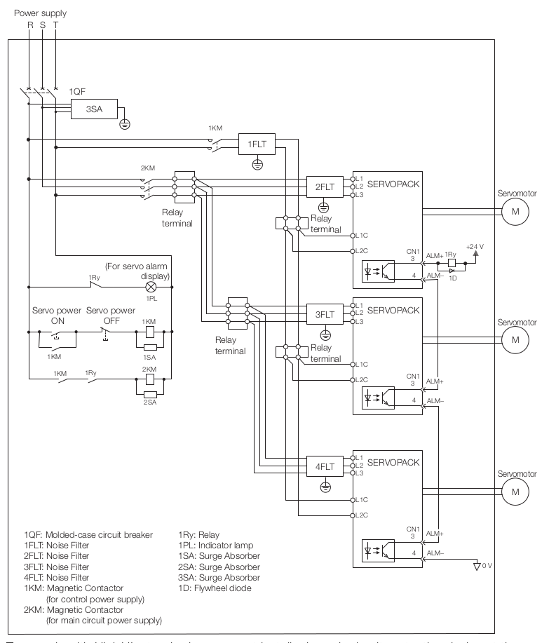

***

### Task List
- Complete annotation
- Finalize coding implementation
- new robot task

***
### 26/06/2026
#### annotation on corrosion

#### preparation about robotic arm (3 hour)   
- [reference manual](./robotic_arm/sigma7_communication_references_project.pdf)
- 
- 
- 
- 
- 4.3: wiring the power supply to the SERVOPACK
  - **required external regenerative resistor between B1/+ and B2**
  - power supply: 200VAC to 240 VAC 50Hz/ 60 Hz
  - 
  - use three phase for continuous, steady flow of energy
  - 
  - 
  - 
  

#### annotation on corrosion
- image count: /6458 (12:00)
### 25/06/2026
#### annotation on corrosion
- image count: 4520/6458 (11:00)
- image count: 5000/6458 (15:00)
- image count: 5579/6458 (17:00)
#### preparation about robotic arm (3 hour)
- Control of AC motor
- AC motor driver from yaskawa
- introduction to ROS (robotic operating systme)
  - [ROS](./robotic_arm/ROS.pdf)

### 24/06/2026
#### preparation about robotic arm (5hour)
- choice of motor
  - AC motor
  - AC servo motor
  - BLDC motor
- power input
  - 48V DC (will cause too much current when driving motor 60-100A)
  - 220VAC 
    - easier to obtain from wall socket
    - fewer motor choice
    - have to choose some weaker motor
  - 400VAC
    - difficlt to obtain
    - better motor choice
    - can go faster with lower current

- 200VAC S7G gear motors 500W-7.5kW
  - https://www.yaskawa.com/products/motion/sigma-7-servo-products/gear-motors/s7g-gear-motors

servo control
- servo pack
  - Model Code Subtype: SGD7S-xxxxxxx00
    - control by 5V/24V square-wave pulse, each pulse equal to 0.001 degrees of rotation, faster the pulse, faster the spin
  - Model Code Subtype: SGD7S-xxxxxxxA0
    - control via Ethernet 

Force and torque
- waist motor: 330Nm
- elbow motor: 266Nm
  - Gravity Torque: 193.7 Nm.
  - Segment Mass Resistance: 36.8 Nm.
  - Payload Weight Resistance: 156.9 Nm.
  - Moment of Inertia: 9.25 kg·m².
  - Dynamic Acceleration Torque: 72.6 Nm.
  - Total Joint 2 Torque: 266.3 Nm.
- base motor: 791Nm
  - Gravity Torque: 461.1 Nm.
  - Segment 1 Weight Resistance: 36.8 Nm.
  - Segment 2 Weight Resistance: 110.4 Nm.
  - Payload Weight Resistance: 313.9 Nm.
  - Total System Inertia: 42.0 kg·m².
  - Dynamic Acceleration Torque: 329.7 Nm.
  - Total Joint 1 Torque: 790.8 Nm.

- safety factor 1.5-2
 
**want to know about the dimension limit 
the power/voltage limit 
of the robotic arm
and the budget allowed
how long the arm be
how far the target be
do it really need to throw or just transportation**

#### annotation on corrosion
- image count: 2938/6458 (14:00)
- image count: 3500/6458 (16:00)
- image count: 4020/6458 (17:50)

### 23/06/2026

#### preparation about robotic arm
- want to lift and throw ~32kg luggage
- 6 Dof (degree of freedom)
- Base Servo (Left/Right)
- Shoulder Servo (Up/Down)
- Elbow Servo (Up/Down)
- Wrist Pitch (Up/Down) — Added to original
- Wrist Yaw (Left/Right) — Added to original
- Wrist Roll (Twist) — Added to original
- Gripper Motor (Open/Close)

motor driver for BLDC: https://shop.odriverobotics.com/products/odrive-pro
- ODRIVE PRO
- dual absolute encoder
- 3000W Continous power
- 1 motor per driver
- 14-58V
- 70A continuous (100A peak with heatsink and fan)
- Isolated CAN, UART, Step/Dir and PWM control inputs

#### annotation on corrosion
- image count: 1221/6458 (16:00)
- image count: 1600/6458 (17:00)
- image count: 2010/6458 (17:45)

### 22/06/2026
#### annotation on abandon
- image count: 10000/13151 (10:30)
- image count: 11038/13151 (13:00)
- image count: 12053/13151 (15:00)
- image count: 13151/13151 (17:41)
#### revise the image missed previously 

### 18/06/2026
#### annotation on abandon
- image count: 6545/13151 (15:00)
- image count: 7700/13151 (16:30)
- image count: 8200/13151 (17:00)
- image count: 9056/13151 (17:55)

### 17/06/2026
#### annotation on abandon
- image count: 1521/13151 (14:30)
- image count: 3806/13151 (17:17)
- image count: 4127/13151 (17:50)
### 16/06/2026
sick leave

### 15/06/2026
- Completed first PCB schematic design in KiCad  
- Completed first PCB layout in KiCad  
- Reviewed documentation for new LiDAR (Robosense M1 Plus)  
- Discussed integration strategy for new LiDAR  
- Coordinated with mechanical team on mounting holes and PCB dimensions  

**STM32F103C8T6 (Blue Pill) Development**
- Implemented synchronization system: 8 Hz signal aligned to 1 Hz reference  
- Configured PC13 as 1 Hz synchronization output  
- Configured PA8 for input capture  
- Configured PA9 as 8 Hz signal output  

***

### 12/06/2026
- Reviewed documentation for Robosense M1 Plus LiDAR  
- Drafted initial PCB schematic in KiCad  

***

### 11/06/2026
- Sick leave  

***

### 10/06/2026
- Sick leave  

***

### 09/06/2026
- Reviewed system component documentation:
  - LiDAR  
  - Camera  
  - GNSS  
  - MCU  
- Set up development environment:
  - VS Code  
  - STM32CubeIDE  
  - STM32CubeMX  
  - KiCad 9.0  

***
